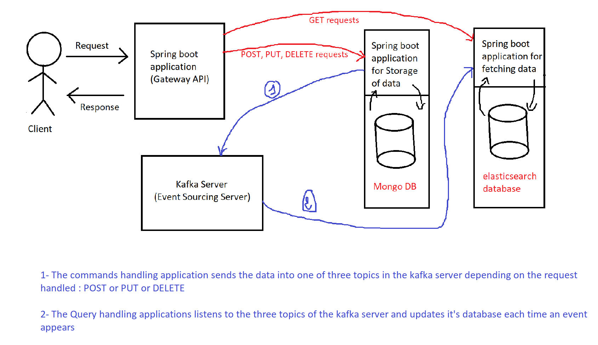

# Product Management Demo (CQRS solution)
This repository Contains the source code fo an application responsible for managing the access to a Product resource.

## Requirements 
In order to have the application up and running in your system you need to have the following:

* Kafka server (The configuration of the Kafka is required)
* MongoDB connection string
* ElasticSearch database
* all applications have their pom.xml file containing all packages required

## Architecture

## Application workflow
The gateway api is the only access point provided to the client. It's goal is to forward the client's requests to the corresponding application (Reading application if the client is trying to fetch data and the writing application otherwise) 
The synchrnization between databases of the two applications is made by three topics created in the Kafka server

## Future features
The next step in this project is managing access authorization to the endpoints creted in this application